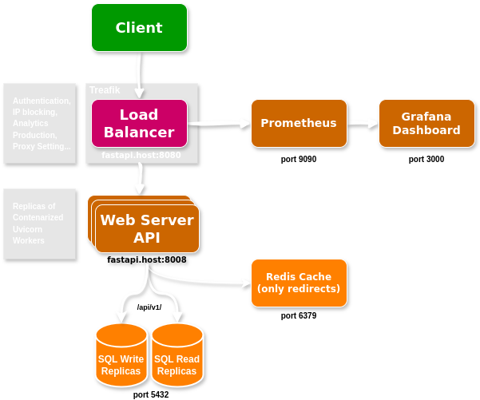

### URL Shortener Code Challenge

We need to build an URL shortener like `goo.gl`, `https://www.shorturl.at/` or `https://bitly.com/` for publishing promotions over Twitter.
You need to build the solution architecture with the following requirements:

- URLs has undefined lifetime
- Platform needs to support 1M RPM peaks of traffic
- We need to have access to nearly real time usage statistics
- Published URLs must be configurable:
- Enable or disable
- Modify destination URL
- URL resolution needs to be done as faster as possible and with the lowest cost
- We need to assure an 99,98% uptime

Need to consider:

- You will be asked for every component built, its responsibility and why it's included in the
  solution
- Infrastructure
- Tools
- Alternatives evaluated and the reasons why you choose the ones used
- _Nice to have:_ Graphical representation and a short description of the solution
- _Nice to have:_ A functional REST API running on any Cloud Provider of your choice (no
  need to waste money)
- supporting 5000 RPM for demo purposes
- Everything needs to be in a Source code repository (Github, Gitlab, Bitbucker or similar).
- No need to give public access if you don't want to. But you will need to share it
  with your interviewers.

##### Solution Overview

<p align="center">
  
</p>

The application consists of three main layers: a Reverse Proxy, web server workers, and a database layer. The Application Proxy (Traefik) handles authentication, security, logging, observability, and load balancing, distributing incoming traffic to multiple stateless web server workers. The web servers process requests to shorten URLs and redirect shortened URLs to their original destinations asynchronously. They interact with PostgreSQL for persistent storage, where the master database manages writes, and read replicas handle read operations to optimize performance. Redis serves as an in-memory cache, speeding up the resolution of frequently accessed URLs by storing short codes and their corresponding original URLs.

When a request is made, the web server first checks Redis; if the data is found, it is returned immediately (cache hit). If not, the server queries PostgreSQL, stores the result in Redis for future requests, and then responds to the client. This architecture supports horizontal scalability, with additional web servers handling increased traffic, read replicas distributing the database read load, and Redis reducing database access latency.

```
# Using the current docker-compose this are the endpoints:
# App URL: http://fastapi.localhost:8008/
# Dashborad URL: http://fastapi.localhost:8080/dashboard/
```

###### API Overview:

The user-facing API has two main routes: the landing page, where users can register a new URL, and a redirect route that directs users to the original URL. Additionally, there are private routes under /api/v1/ that handle internal tasks such as deleting or deactivating a short URL.

###### Hash Strategy:

Instead of using a hashing algorithm and implementing complex strategies to avoid hash collisions, I opted to use a simple increasing index and encode it as a URL-safe Base64 string. Eight digits are more than sufficient to uniquely represent all URLs on the internet, and also the conversion function is much faster than any hashing scheme, eliminating the need to handle collision logic at the API layer. Additionally, SQL databases efficiently handle the lookup and insertion of integer indices, making this approach both performant and straightforward. This method also ensures deterministic URL generation, which can simplify debugging and reduce the risk of unpredictable behavior often associated with hash-based schemes. To enhance security, we could add a salt to the short URL and encrypt it, ensuring that the database index is not transparent to the user.

###### Database of Choice:

PostgreSQL is well-suited for this URL shortener project due to its extensive testing and industry-proven reliability, backed by decades of development and performance improvements. Although it may not scale horizontally as extensively as NoSQL databases, PostgreSQL can still meet scalability needs through read and write replicas. Given that most requests involve redirecting a relatively small number of short URLs, the database will not experience significant load. Additionally, PostgreSQL offers greater flexibility for adding future features compared to other databases.

###### Loader Balancer (Treafik):

Traefik offers many crucial features for the application, including a Web UI, authentication, IP banning, custom middleware, logging, integration with observability tools, and, most importantly, load balancing for all web servers. The choice of Traefik was primarily driven by the need for a quick development turnaround. In other scenarios, it might be beneficial to explore more specialized solutions to better meet specific needs.

###### Cache:

A Redis instance handles caching only for the redirecting route, which constitutes most of the app's requests. The main challenge is managing cache invalidation in sync with the database. While Redis can be configured with replicas for high availability and scaling, only a single Redis instance is used here due to time constraints.

###### Redundancy:

Most systems in the app are designed with redundancy: the PostgreSQL database utilizes multiple read and write replicas, and web servers run one Uvicorn worker per Docker container with many replicas and failover strategies. The Application Proxy, however, poses a potential single point of failure. To address this, we could deploy the proxy in another cloud region and using DNS-based load balancing to distribute traffic and ensure continuous availability. Discussion on why to use one uvicorn worker per docker container can be found in the fastapi docs.

###### Observability:

Observability is managed using Traefik's built-in functions to export data to Prometheus. This data is then consumed and visualized in a Grafana instance. Other possible solution would be to use a Message Queue to log all the income request on the level of the web server and then a separate process/service to consuming this queue and feed a analytics DB.

```
# Grafana URL: localhost:3000
# import dashbord in `./grafana/dashboard.json`
```

###### Security:

I was unable to add authentication to the API routes or configure SSL/TLS certificates in Traefik to enable HTTPS. However, other security concerns can be addressed by configuring appropriate settings in the application proxy.
